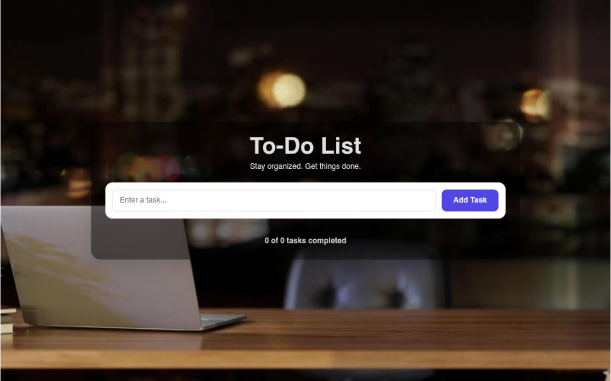

# 📝 To-Do List App

A simple and responsive To-Do List application built using HTML, CSS, and JavaScript.

## Preview



## Live Demo

🌐 Live Website: https://to-do-app-tawny-nu-26.vercel.app/

## Features

* Add new tasks
* Mark tasks as completed
* Delete tasks
* Save tasks using Local Storage
* Responsive design
* Clean and modern UI

## Technologies Used

* HTML5
* CSS3
* JavaScript (ES6)

## Project Structure

```bash
Todo-App/
│
├── index.html
├── style.css
├── script.js
└── README.md
```

## What I Learned

Through this project, I practiced:

* DOM Manipulation
* Event Listeners
* Local Storage
* JavaScript Arrays
* Responsive Design

## Author

**Anshul Gothwal**

* GitHub: https://github.com/AnshulGothwal

---

⭐ If you like this project, feel free to give it a star.
